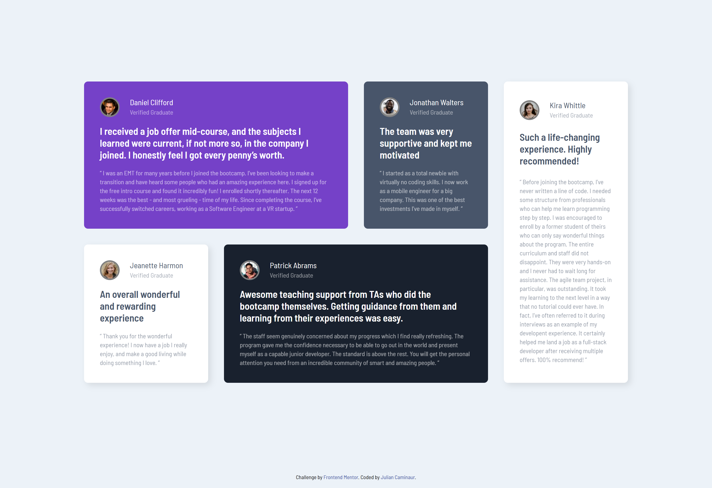

# Frontend Mentor - Testimonials Grid Section Solution

## Overview

### The Challenge

Your users should be able to:

- View the optimal layout for the site depending on their device's screen size.

### Screenshot

### Links

- Live Site URL: [Live Site](https://caminaur.github.io/Testimonials-grid-section/)
- Solution Repository: [Github](https://github.com/Caminaur)

## My Process

### Built With

- Semantic HTML5 markup
- CSS custom properties
- Flexbox / CSS Grid

### Continued Development

In future projects, I want to focus on accessibility best practices and improving how I structure CSS for scalability.

### Useful Resources

- [CSS Grid Guide by MDN](https://developer.mozilla.org/en-US/docs/Web/CSS/CSS_Grid_Layout)

## Author

- [Website](https://julian-caminaur.tech/)
- [Frontend Mentor](https://www.frontendmentor.io/profile/Caminaur)
- [CSS Battle](https://cssbattle.dev/player/caminaur)
- [Exercism](https://exercism.org/profiles/Caminaur)
